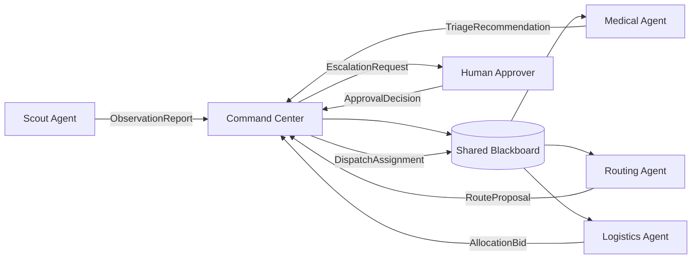

# Disaster Response Multi-Agent System

This project prototypes a small multi-agent system (MAS) for flood response. It is intentionally lightweight and mocked, but it includes the core parts expected in Assignment 3: agent role boundaries, a communication protocol, a coordination mechanism, safety controls, observability, evaluation criteria, and a runnable simulation.

## Quick Start

```bash
python -m pip install -e .
python -m disaster_mas.simulate --scenario flood --seed 42
```

If package installation is unavailable, run directly from the `src` layout:

```bash
PYTHONPATH=src python -m disaster_mas.simulate --scenario flood --seed 42
```

Run the tests:

```bash
python -m unittest discover -s tests
```

Available scenarios:

```bash
python -m disaster_mas.simulate --scenario flood --seed 42
python -m disaster_mas.simulate --scenario aftershock --seed 42
python -m disaster_mas.simulate --scenario conflicting_reports --seed 42
```

## System Brief

The use case is disaster response after a flood that affects multiple zones. Stakeholders include civilians, first responders, emergency medical teams, operations command, transport/logistics teams, municipal partners, and public-sector auditors. The objective is to produce a defensible incident action plan that gets scarce teams, vehicles, and supplies to the highest-risk locations while avoiding unsafe dispatches.

Failure stakes are high: missed rescue windows, duplicated dispatches, blocked-route accidents, unmanaged medical overload, and unauditable decisions. A single agent is not enough because the work requires parallel sensing, medical triage, routing, resource allocation, and governance. Combining these responsibilities into one agent would create bottlenecks and weaken separation of duties.

## Agent Roster

| Agent | Responsibility | Tools / Data | Memory | Permissions |
| --- | --- | --- | --- | --- |
| Scout | Reports flood damage, stranded people, and confidence | Field observations | Local observations only | Can observe and report |
| Medical | Triage zones by likely harm and urgency | Casualty estimates, zone reports | Triage notes | Can recommend care priority, cannot dispatch |
| Routing | Finds safe routes and flags blocked roads | Mock route status | Route proposals | Can recommend routes, cannot allocate teams |
| Logistics | Proposes use of teams, ambulances, boats, and supplies | Resource inventory | Allocation bids | Can bid on allocations, cannot approve risky tradeoffs |
| Command Center | Coordinates messages, shared state, conflicts, assignments | Blackboard, bids, escalations | Incident state and audit log | Can assign resources and escalate |
| Human Approver | Reviews high-risk or low-confidence decisions | Escalation packet | Approval decisions | Can approve or reject risky actions |

## Architecture



The coordination model is a hybrid: a blackboard stores shared incident state, the command center acts as supervisor, and scarce resources are allocated through a simple contract-net style bidding step.

## Communication Contract

Every inter-agent message uses the same schema:

| Field | Purpose |
| --- | --- |
| `message_id` | Unique ID for audit and replay |
| `timestamp` | Deterministic simulation timestamp |
| `sender` | Agent that produced the message |
| `receiver` | Target agent or broadcast |
| `message_type` | Typed intent such as observation, triage, bid, escalation, approval |
| `priority` | `low`, `normal`, `high`, or `critical` |
| `location` | Zone affected by the message |
| `payload` | Structured content |
| `confidence` | Number from 0.0 to 1.0 |
| `requires_human_approval` | Whether the message triggers human review |
| `correlation_id` | Thread ID connecting related messages |

Routing rules are explicit. Scout messages go to command center. Command center writes validated observations to the blackboard. Medical, routing, and logistics read blackboard state and return recommendations. Human approval is required when confidence is low, route risk is high, or scarce resources force a life-safety tradeoff.

## Coordination And Incentives

The blackboard lets agents work from the same incident picture without pretending they share internal reasoning. The supervisor prevents duplicate dispatches and resolves conflicts. The contract-net step lets logistics, routing, and medical priorities compete for scarce resources while the command center optimizes the global objective.

Local objectives:

- Scout maximizes accurate coverage.
- Medical minimizes expected harm.
- Routing minimizes dispatch risk and travel delay.
- Logistics minimizes resource waste and unmet need.
- Command center balances life safety, feasibility, and auditability.

Global constraints override local goals: no dispatch to a blocked route without a safe alternate, no high-risk allocation without approval, and no duplicate assignment to the same scarce team.

## Emergence

Expected emergent behavior:

- Adaptive prioritization as route and triage information combine.
- Redundant discovery when multiple observations point to the same zone.
- Faster convergence on a rescue plan than a single centralized decision loop.

Unwanted emergent behavior:

- Duplicated dispatches when agents optimize locally.
- Priority inflation when every agent marks its recommendation critical.
- Stale-map cascades when outdated route data drives multiple bad decisions.
- Over-escalation that slows response during time-sensitive incidents.

The prototype mitigates these through typed priorities, shared state, conflict detection, approval gates, rollback checkpoints, and an audit log.

## Interoperability

A production version would use A2A-style boundaries for agent messages and MCP-style boundaries for external tools. Examples include route APIs, weather feeds, hospital-capacity systems, SMS dispatch providers, radio logs, GIS layers, and immutable audit storage. The prototype keeps these mocked but preserves the boundary shape in message contracts and role permissions.

## Operations, Safety, And Governance

The simulation emits a transcript, final action plan, and audit log. Each decision is replayable by scenario and seed. Rollback checkpoints are logged before dispatch assignments, and high-risk decisions require a human approval message. Abuse and failure cases include spoofed reports, outdated route data, resource hoarding, conflicting observations, missing approvals, and unsafe autonomous dispatch.

Evaluation happens at four levels:

- Agent: message validity, permission compliance, confidence calibration.
- Interaction: conflict resolution, escalation correctness, duplicate prevention.
- System: response time proxy, unmet critical needs, route safety, resource utilization.
- Human: approval burden, clarity of escalation packets, auditability.

## MARL Bridge

Multi-agent reinforcement learning could eventually help tune resource allocation policies in offline simulation, especially when many incidents and resource constraints are modeled. It is not appropriate for this prototype's live safety-critical decisions because the environment is sparse, high-stakes, hard to reward correctly, and requires explainable human oversight.

## Assignment Criteria Mapping

| Rubric Category | Where Covered |
| --- | --- |
| Use-case quality and stakeholder framing | System brief |
| Agent role design and boundaries | Agent roster and code permissions |
| Communication protocol and architecture | Message schema, routing rules, Mermaid diagram |
| Coordination and incentive design | Hybrid model and incentive analysis |
| Prototype, simulation, or worked scenario | CLI simulation and scenarios |
| Evaluation, observability, and safety | Audit log, tests, evaluation plan, governance controls |
| Presentation and clarity | README plus docs folder |
