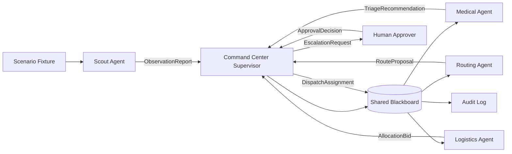

# Architecture

## Coordination Model

This prototype uses a hybrid coordination mechanism:

- Blackboard: shared incident state for reports, route status, triage, bids, assignments, resources, approvals, conflicts, and audit events.
- Supervisor: the command center controls sequencing, conflict detection, escalation, and dispatch assignment.
- Contract net: logistics bids for scarce resources using triage urgency, route delay, route risk, and resource requirements.

This hybrid is more appropriate than pure hierarchy because specialized agents still contribute domain-specific recommendations. It is more practical than full consensus because disaster response is time-sensitive and needs clear accountability.

## Diagram

## Data Flow

1. Scenario fixture provides reports, route status, and resource inventory.
2. Scout sends observation reports to command center.
3. Command center validates and writes observations to the blackboard.
4. Medical reads reports and returns triage recommendations.
5. Routing reads reports and route status, then returns safe route proposals.
6. Logistics combines triage and route proposals into allocation bids.
7. Command center ranks bids, escalates risky or scarce-resource decisions, and writes dispatch assignments.
8. Audit events record the rationale and reference message for each important decision.
